<div align="center">

# 老奶奶 GTA · 阿嬤俠盜：田庄大亂鬥

**一个在浏览器里就能玩的台湾乡村开放世界。主角是 72 岁的秀琴阿嬤。**
广场舞斗舞、蓝白拖连击、抢车、被警察追、抓大鹅……全部由 AI 工具链制作：
**Tripo** 做 3D 角色与动作，**Claude Code** 写游戏，**Three.js** 渲染。

**[🎮 在线试玩](https://andyhuo520.github.io/grandma-gta/)** · [English](README.en.md) · [▶ 观看预告片](https://github.com/andyhuo520/grandma-gta/releases/tag/v1.0.0) · [快速开始](#快速开始) · [制作工作流](#制作工作流)


<a href="https://github.com/andyhuo520/grandma-gta/releases/tag/v1.0.0">
  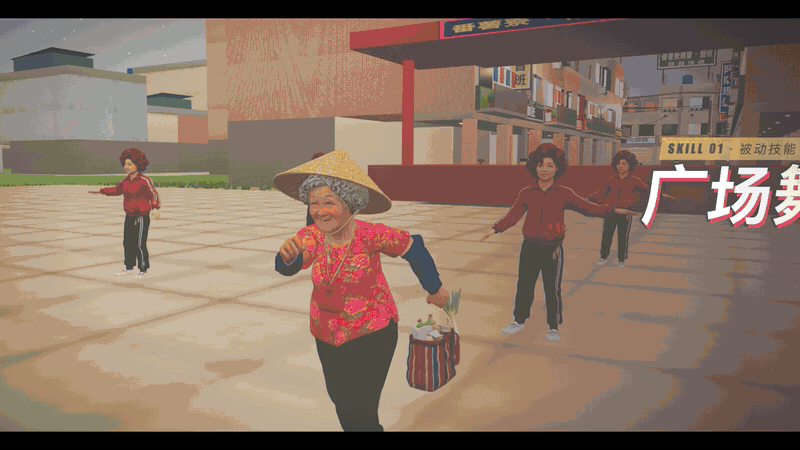
</a>

<sub>预告片开场（静音预览）。完整 1 分 47 秒 2K60 预告片在 <a href="https://github.com/andyhuo520/grandma-gta/releases/tag/v1.0.0">Releases</a>。</sub>

</div>

---

## 玩法

番薯寮是一个虚构的台湾中南部小镇：妈祖庙口广场、传统市场、骑楼老街、三合院、稻田和铁皮仓库。你扮演秀琴阿嬤，在小镇里做任务、打坏人、抢车，还有一段黄昏恋。

<table>
<tr>
<td width="33%">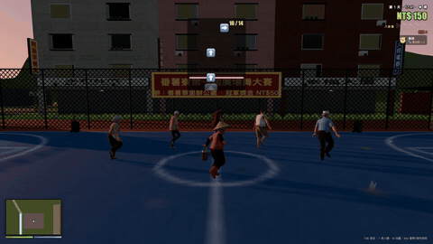<br><b>广场舞 · 被动技能</b><br>节奏小游戏，箭头落到白线时按方向键。拿下冠军才能抢到广场时段。</td>
<td width="33%">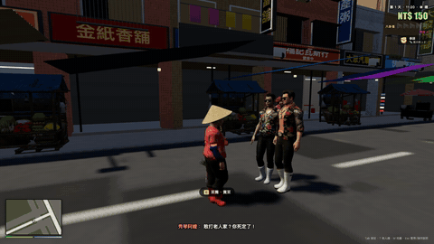<br><b>扇巴掌 · 近战技能</b><br>拳、踢、挥棍、丢蓝白拖。被打倒的人头上冒星星，不见血。</td>
<td width="33%">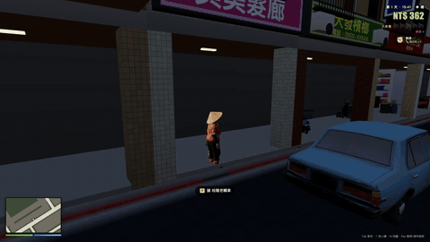<br><b>抢车 · 特殊玩法</b><br>按 F 把司机拉下车。三轮车、机车、老轿车、发财车、小黄都能开。</td>
</tr>
<tr>
<td>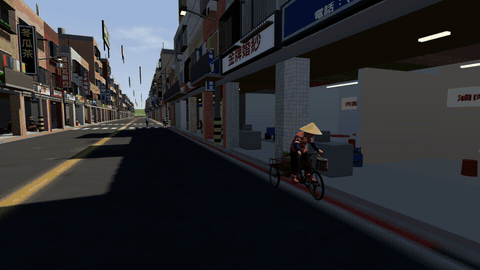<br><b>快跑 · 逃脱玩法</b><br>闹事会涨「八卦值」（1–5 个大声公），老警察会骑车来追。去庙里拜拜可以清八卦值。</td>
<td>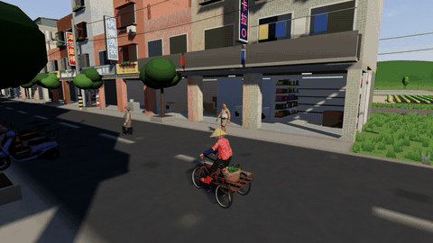<br><b>骑车兜风</b><br>电动三轮车带 4 个电台：台语老歌、电子花车、地下电台卖药、那卡西。</td>
<td>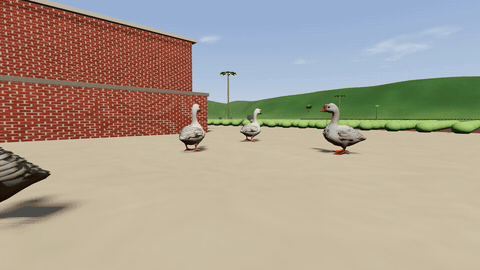<br><b>抓大鹅 · 支线</b><br>75 秒内把 6 只逃跑的大鹅扑回鹅寮。大鹅会散步、啄食、逃跑、起飞，还会反咬你。</td>
</tr>
</table>

**内容一览**

- **主线两章，共 13 关**
  - 第一章：生日的早晨 → 送报纸 → 柑仔店的礼物 → 菜市场保护费 → 追存折飞车战 → 阿嬤开小黄 → 广场舞大赛。
  - 第二章「金牙伯的挑战」：卡拉 OK 对唱、跟踪、直捣诈骗窝、台风夜求婚。
- **支线**：计程车载客、捡纸箱回收、采高丽菜卖、刮刮乐、拜土地公、抓大鹅。
- **城镇系统**：交通 AI 会停红灯；NPC 执法；昼夜与天气；商店与经济系统；换装（花布衫可以换成豹纹、迷彩、金亮片）；「痞度」会影响物价和路人的态度。
- **配音**：12 种角色音色，共 110 句台湾腔对白。

## 快速开始

直接打开 **https://andyhuo520.github.io/grandma-gta/** 就能玩（首次加载约 80 MB 模型，推荐用电脑上的 Chrome）。

想在本地运行的话，不用安装依赖，也不用构建，只要有 Python 3 和一个现代浏览器：

```bash
git clone https://github.com/andyhuo520/grandma-gta.git
cd grandma-gta
python3 tools/serve.py        # http://localhost:8965
```

用 Chrome、Edge 或 Safari 打开 `http://localhost:8965`。`serve.py` 只是一个禁用缓存的静态服务器，改完代码刷新页面就生效。

| URL 参数 | 作用 |
|---|---|
| `?nostory` | 自由模式，不自动开始主线 |
| `?story=N` | 从第 N 关开始 |
| `?rich` | 开局给 NT$20,000 |
| `?autostart` | 跳过标题画面 |

**操作**

| | 按键 |
|---|---|
| 走路 | `WASD` 移动 · `Shift` 跑 · `Q` 痞步 · `E` 互动 · `空格` 骂人 |
| 战斗 | `左键`/`J` 打人 · `G` 丢蓝白拖 · `X` 抽烟 · `H` 喝补药 · `B` 嚼槟榔 |
| 车辆 | `F` 上车/抢车/下车 · `W/S` 油门/倒车 · `A/D` 转向 · `空格` 刹车/喇叭 · `R` 换电台 |
| 界面 | `Tab` 背包 · `T` 老人机（任务菜单）· `M` 地图 · `1-9` 选对话 · `Esc` 暂停 |

> 广场舞原曲受版权保护，仓库里没有附带。没有原曲时，游戏会现场合成一段同 BPM（127）的五声音阶广场舞循环，节奏游戏照样能玩。如果你有合法音源，把副歌放到 `assets/music/square-dance-chorus.mp3` 即可替换。

## 制作工作流

整个项目由一个人加几个 AI 工具完成。三条主线是：**Tripo 出资产 → Claude Code 写游戏并自动测试 → 逐帧录制并剪成预告片**。

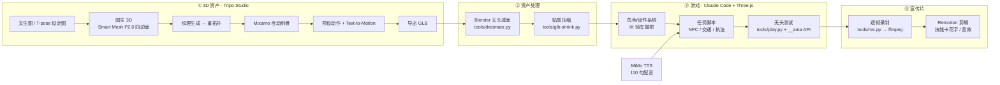

### ① 用 Tripo Studio 做角色、动物、道具和动作

主要角色全部在 **Tripo Studio 3D 工作台**里完成，每一步都有录屏，同时可以直接当宣传素材：

| 步骤 | Tripo 功能 | 录屏 |
|---|---|---|
| 设定图 | 图片生成：T-pose 模板 + 角色描述（72 岁、花布衫、斗笠、红雨鞋……） | 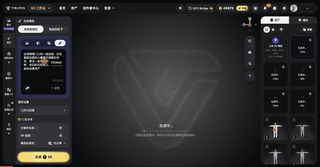 |
| 建模 | 一键转 3D，**Smart Mesh P2.0** 原生四边面，一次生成 4 档面数（约 2k–23k） | 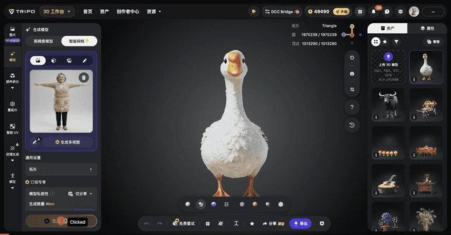 |
| 贴图与绑骨 | 纹理生成 → 重拓扑（三角面）→ **Mixamo 自动绑骨**，一套骨骼所有角色通用 | 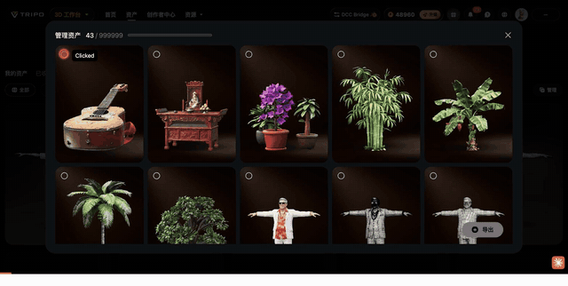 |
| 动作 | 22–25 个预设动作（走、跑、拳、踢、挥棍、跳舞、讲电话……）+ **Text-to-Motion** 多段串接，如金牙伯的「炫富大笑」 | 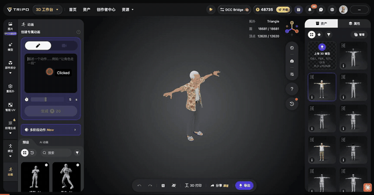 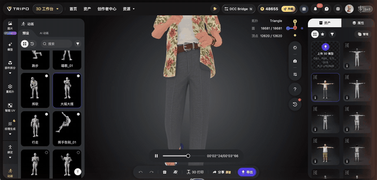 |
| 批量导出 | GLB 导出（全选动作）；大鹅、水牛、榕树、骑楼道具用文生 3D | |

导出的 GLB 在游戏里做了几种展示，代码在 `tools/showcase.html`：

<table><tr>
<td>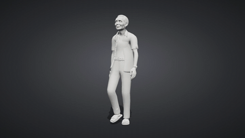<br>白模 → 贴图扫描</td>
<td>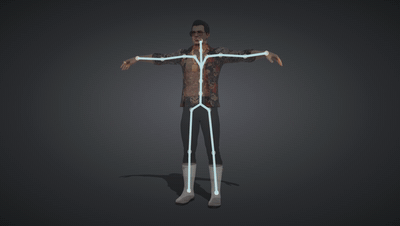<br>Mixamo 骨骼可视化</td>
<td>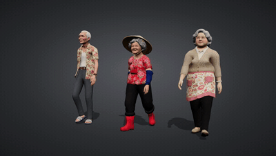<br>同一套骨骼、同一个动作</td>
</tr></table>

### ② 资产处理

- 文生 3D 的模型高达约 200 万三角面，用 **Blender 5 无头模式**减面：`tools/decimate.py` / `tools/decimate-all.sh`。
- `tools/glb-shrink.py` 把贴图缩到 512–2048，GLB 体积压到几 MB。
- `tools/glbinfo.py` 列出骨骼、动作名和面数。Studio 重复导出时动作名会带 `.001` 后缀，加载器会自动去掉。
- 部分道具和早期 NPC 是用 Combos CLI 批量调用 Tripo 生成的：`tools/fetch-assets.sh`。

### ③ 用 Claude Code 写游戏

全部游戏代码（约 8,000 行 ES Module）都是 **Claude Code** 在对话里写出来的，不依赖构建工具或游戏引擎，只用 Three.js r180 + importmap。几个值得一看的实现：

| 模块 | 做法 |
|---|---|
| `src/actor.js` | 与骨骼体系无关的动画层（Mixamo / Tripo 41 骨通用）。自动找出出拳的命中帧（手或脚离髋部最远的那一帧）；两骨 IK 实现抽烟和握龙头；`leanToBars` 让身体前倾、锁骨前伸，`gripHand` 让手掌朝下、手指弯曲，所以 0.41 m 的短手臂也能握到车把。 |
| `src/goose.js` | 大鹅模型本身是静态网格，在 `onBeforeCompile` 里注入顶点着色器，让脖子弯曲、腿摆动、起飞时收脚；两片程序化翅膀负责扑翅。状态机：散步 / 啄食 / 鸣叫 / 之字形逃跑 / 起飞 / 冲撞 / 晕眩。 |
| `src/entities.js` | 倒地的身体每帧对墙体做 `resolve()`，防止被打飞后穿进墙里。阿嬤扑鹅用原地版动作（`dive_ip`），身体按实测的 `DIVE_CURVE` 位移。 |
| `src/law.js` | NPC 执法：警察抓的是真正动手的人，不看谁长得像流氓；路人自卫不算犯法；过场动画期间休战；增援会锁定目标。有 14 个单元测试。 |
| `src/buffalo-*.js` | 水牛的步态由实际走过的距离驱动；30 / 60 fps 下走出的路径一致（有测试）。 |
| `src/world/` | 小镇完全程序化生成：骑楼、马赛克磁砖、铁窗、招牌图集、红绿灯、稻田水面。 |
| `src/audio.js` | WebAudio 合成音效和 4 个电台；没有原曲时生成广场舞音乐。 |

**测试与调试**：页面暴露一个调试 API `window.__ama`，提供 `start / tp / run / shoot / enter / story()` 等方法。`tools/play.py` 用 Playwright 无头 Chromium 跑步骤脚本（`waitjs / js / wait / shot`），每一关都能自动从头打到尾。单元测试：

```bash
node --test tests/*.test.mjs   # 20 个测试：NPC 执法 + 水牛移动
```

### ④ 预告片是怎么做的

- **录制游戏画面**：`tools/rec.py` 冻结游戏时钟，一帧一帧推进并截图，帧数据直接通过管道交给 ffmpeg，所以 60 fps 不掉帧，跟机器性能无关。
- **录制 Tripo 界面**：用 Screen Studio 录 Tripo Studio 的操作。
- **剪辑**：Remotion（React 写视频）。开场用了 GTA 风格的半屏「技能卡」（标签 / 大标题 / 类别 / 一句描述 / 能力条），按音乐每 3 拍切一次；任务成功和失败用 MISSION PASSED / WASTED 全屏卡；对白做成漫画气泡。口播底片由 Codex 制作，Claude Code 在上面叠加花字层和音效层。
- **配音**：小米 MiMo TTS（voice design）为 12 个角色生成 110 句对白，脚本是 `assets/voice/gen_lines.py`，台词在 `assets/voice/lines.json`。

## 用到的工具

| 工具 | 用途 |
|---|---|
| [Tripo Studio](https://www.tripo3d.ai) | 角色、动物、道具建模；Smart Mesh P2.0、纹理、重拓扑、自动绑骨、预设动作、Text-to-Motion |
| [Claude Code](https://claude.com/claude-code) | 编写全部游戏代码、工具脚本和测试；通过 Claude in Chrome 操作 Tripo Studio |
| [Three.js](https://threejs.org) r180 | WebGL 渲染、骨骼动画、后期处理 |
| [Blender](https://www.blender.org) 5 | 无头批量减面 |
| [Playwright](https://playwright.dev) | 无头测试、逐帧录制 |
| [Remotion](https://www.remotion.dev) + [FFmpeg](https://ffmpeg.org) | 预告片剪辑、混音、响度标准化（−14 LUFS） |
| Xiaomi MiMo TTS | 角色配音 |
| Combos CLI | 早期部分道具的批量生成 |

## 目录结构

```
index.html            入口（importmap → vendor/three）
src/
  main.js             启动、渲染循环、输入、暂停菜单
  game.js  story.js   存档、任务系统；第一章主线与支线
  chapter2.js         第二章「金牙伯的挑战」
  actor.js            动画层、IK、骑车/坐姿
  entities.js         玩家、NPC、动物、战斗、碰撞
  vehicles.js         载具、交通 AI、电台
  goose.js            大鹅表演与抓大鹅小游戏
  law.js              八卦值与 NPC 执法
  world/              程序化小镇、天空、地形、街道家具
  audio.js fx.js ui.js weather.js grass.js birds.js …
assets/
  chars/ animals/ props/ gear/ nature/   Tripo 生成的 GLB（已减面、压贴图）
  voice/                                 MiMo 配音和生成脚本
tools/                serve / play / rec / decimate / glb-shrink / showcase …
tests/                node:test 单元测试
docs/media/           README 用到的动图
```

## 素材与授权

- **源代码**：[MIT](LICENSE)。
- **3D 模型**（`assets/**/*.glb`）：由 Tripo 生成，随仓库提供，供学习和演示使用。如果要商用，请先确认 [Tripo 服务条款](https://www.tripo3d.ai)。
- **配音**（`assets/voice/l/`）：由小米 MiMo TTS 生成。
- **音乐**：仓库里没有附带受版权保护的歌曲，详见上文「快速开始」。
- 游戏里的店名和品牌都是虚构或谐音。

---

<div align="center">

觉得阿嬤可爱的话，给个 ⭐ 吧。想自己做一个？先去 [Tripo](https://www.tripo3d.ai) 生成你的第一个角色。

</div>


## Android 平板适配（浏览器版）

本分支保留原版地图、任务、模型和游戏规则，扩展触屏与外接键鼠输入。

- Android Chrome 横屏打开；首次仍需加载原版资源。
- 左下摇杆移动，滑动画面转视角，右下按钮攻击、互动、上下车、奔跑等。
- 顶部可打开背包、手机、地图、暂停 / 返回；跳舞时显示方向按钮。
- 触屏与键盘可同时使用；只用键鼠时可点“触控：关”隐藏下方按钮。
- 鼠标锁定失败或不可用时：左键攻击，按住右键拖动转视角。
- 暂停菜单提供低 / 中 / 高画质并记住选择；平板默认中画质，低 / 中关闭阴影，自动分辨率不超过所选档位。
- 全屏按钮会尝试横屏锁定，不支持时手动旋转平板。

验证：`node --test tests/*.test.mjs`。Android 蓝牙键鼠、GPU 帧率及完整任务流程仍需真机验收；当前不提供 APK。
